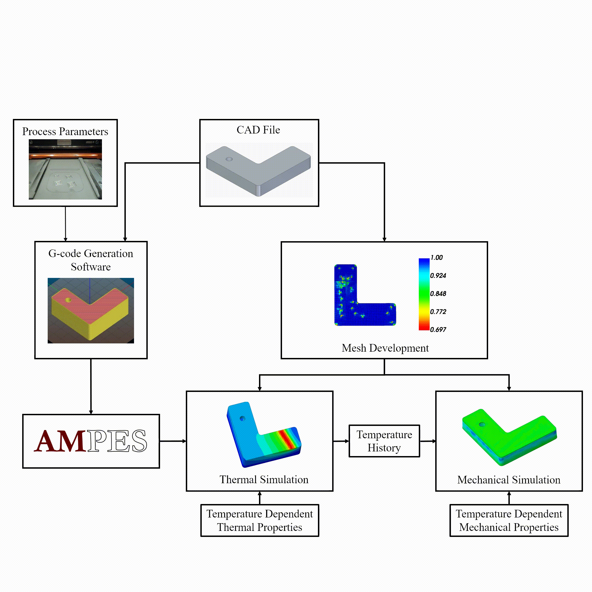

# AMPES: Additive Manufacturing Process Event Series generator

**Authors**: David P. Failla Jr., Chuyen J. Nguyen

The Additive Manufacturing Process Event Series generator, AMPES, is a Python-based code for developing an event series to be used with numerical simulation work. AMPES leverages open-access Python modules and g-code slicing software to create an event series to represent the heat source following a tool path or laser path of a given additive manufacturing (AM) process. This allows for the capturing of raster scanning effects inherent of most AM processes within a thermomechanical modeling framework. While initially developed for use with laser-powder bed fusion (L-PBF), AMPES has been extended for usage with blown-powder laser directed energy deposition (L-DED), wire arc directed energy deposition (WA-DED), and fused deposition modeling (FDM). 



> Example of a Sequentially-Coupled Thermomechanical Finite Element Modeling Pipeline That Leverages AMPES for Event Series Generation to Mimic the Position and Power of the Heat Source Model for Accurate Raster Scanning 

# Requirements

Slic3r Version: 1.3

Python Version: 3.10

Python Packages:

* NumPy
* PyYaml

Dependencies can be installed using the included `requirements.txt` file by executing the following line:

```
pip install -r requirements.txt
```

# Usage 

## STL to RepRap G-code

AMPES accepts RepRap flavored g-code as the input file for determining the event series coordinate positions. G-code file generation can be handled using any g-code slicing software, although Slic3r \[1\] was the software used for AMPES development. The g-code file must be built to mimic the movement of the raster scanning leveraged by the selected AM process. This requires an <em>.stl</em> file of the selected geometry to be modeled and AM process information such as the material layer/deposition height, hatch spacing, tool/laser speed, etc. to be used with the g-code generation. Please see the provided single and multi group AMPES examples for an illustration of a developed RepRap g-code file for usage with AMPES. The primary difference between the slicing software options the user may want to consider are the scan strategies available. While meander, also called rectangular is one of the most common scan strategies implored, different AM builds may use different strategies and therefore the user may need to look into different g-code slicer options to generate the RepRap g-code file.

## AMPES Overview

AMPES comes with several command-line arguments to assist in both ease of use and customization per run. Use 

```
python src/AMPES.py --help
```

to have a summary of these arguments printed out.

**Input Arguments**

* `-i`, `--input_gcode` Directs to the g-code file that will be converted into an event series. If unspecified the script will search for a file ending in `.gcode` in the current working directory
* `-c`, `--config` Directs to the YAML configuration file. This will attempt to load `<current working directory>/input.yaml` if unspecified. For setting up this file refer to [its corresponding section](#input-yaml).

**Output Arguments**

* `-d`, `--ouput_dir` Directs to the folder that will hold the event series output. Will create if necessary and populate a `<current working directory>/output` directory by default.
* `-o`, `--outfile_name` Specifies the base name for the output filename format. For further details refer to the [output files section](#outputs).

## Input YAML

AMPES interprets print parameters using a YAML format file with the following common parameters:

* `interval` \[`int`\]: the number of points interpolated between every two points of the g-code file
* `layer_height` \[`int`, `float`\]: the height to increase z value by between every layer in mm
* `substrate` \[`float`\]: the height of the substrate in mm

### Input YAML Subsections

The following describes different sections of the input YAML file where variables directly relate to each other.

Example input YAML files for single and multiple groups are configured for L-PBF event series output and are provided at the root of this repository. Templates are also provided at the root of the repository under `template_input.yaml` and `template_input_multi_group.yaml`, which show the use for one set of parameters for a whole job and multiple groups for specific layers of a job, respectively. By default, the YAML file expects values with units in SI(mm)

### Layer Groups

AMPES handles functionally graded printing using "layer groups" which are nested YAML variables that allow for the setting of print parameters for different sets of layers.

The parent `layer_groups` variable can contain a number of groups that configure how individual intervals of layers will be handled. An example of a `layer_groups` section configured for two groups of layers is shown below.

```yaml
layer_groups: 
  group_one:
    layers: [1, 95]
    infill:
      base_speed: 1000
      output_speed: 800
      power: 4000000
    contour:
      base_speed: 500
      output_speed: 600
      power: 2000000
    interlayer_dwell: 10.0
  group_two:
    layers: [96, 128]
    infill:
      output_speed: 800
      power: 2000000
    contour:
      output_speed: 600
      power: 1000000
    interlayer_dwell: 10.0
```

The group names are irrelevant to the functionality of AMPES and for the purpose of example the groups are named `group_one` and `group_two`. Each group should have a `layers` variable containing a continuous interval of layers which should be included within the group. AMPES treats the interval as an inclusive interval and treats the layers as starting with one rather than zero.

In the case that the user has only one set of values that they wish to apply to all layers of a build, they can supply only one layer group within the `layer_groups` section with no `layers` variable. AMPES will read this one group's properties and use it for every layer supplied within the g-code. Single groups with an included `layers` interval can still be used to print specific layer intervals with set print parameters.

Both the `infill` and `contour` sections of each layer group section will require a `power` variable that dictates the value in milli-Watts, respectively, for that section.

The `interlayer_dwell` variable sets the amount of time in seconds waited for between layers until heat source would return to the same X-Y position on a sequential layer. This variable is ignored if the general `dwell` boolean variable is set to `false`.

### Output Speed

AMPES provides optional YAML configuration variables for outputting with different speeds than what was specified in the creation of the input g-code file.

The term is simply `output_speed` and expects a floating point integer value, specifying the desired output speed for the section it is in in mm/s.

This term can be used inside of any `infill` or `contour` section to alter the output for that respective section.

For the case where the configuration file contains one layer group under `layer_groups` and no `layers` variable tied to that one group, `base_speed` is a required variable and `output_speed` is an optional variable.
If `output_speed` is not present, the `base_speed` given will also be used as the output speed in the resulting event series.

The reason being is that the `base_speed` value will be used to differentiate infill and contour sections within the g-code.

For the case of having more than one layer group, the `base_speed` variable will be required for only the first layer group and `output_speed` will be optional for that first group. AMPES will only use the first layer group's `base_speed` to detect the sections within the input g-code file. This allows for layer-by-layer process parameter modifcations with a single g-code file.

In all subsequent layer groups, `output_speed` will be a required variable, as there is no more detection required and the only speed value required will be the desired output speed.

The example below changes the first layer group's output value to be 600 mm/s for infill sections and 100 mm/s for contour sections in the output file.

```yaml
layer_groups: 
  group_one:
    layers: [1, 95]
    infill:
      base_speed: 1000
      output_speed: 600
      power: 4000000
    contour:
      base_speed: 500
      output_speed: 100
      power: 2000000
    interlayer_dwell: 10.0
  group_two:
    layers: [96, 128]
    infill:
      output_speed: 800
      power: 2000000
    contour:
      output_speed: 400
      power: 1000000
    interlayer_dwell: 15.0
```

### Dwell

The following parameters relate to dwell time. 

* `dwell` \[`boolean`\]: set to `false` to ignore the interlayer dwell times provided by `interlayer_dwell` and `w_dwell`
* `roller` \[`boolean`\]: `true` if a separate roller event series should be generated, else `false`. Developed for usage with L-PBF AM process modeling.
* `w_dwell` \[`int`, `float`\]: the amount of time it takes for the roller/wiper to finish laying down material for the next layer if `roller` is set to true
 
Regardless of value, all variables relating to dwell time are ignored if the `dwell` variable is set to `false` and the event series will be generated assuming as if all dwell-related variables are set to 0.

If `roller` is set to `true`, then the event series will start after `w_dwell` time to give the roller time for the first layer.

### Power Fluctuation

AMPES allows for the fluctuation of power to mimic the real behavior of power. The following parameters allow for configuration of this functionality.

* `power_fluctuation` \[`boolean`\]: set to `false` to apply no power fluctuation i.e. have a static power value
* `deviation` \[`int`, `float`\]: the maximum deviation from the set power value allowed
* `scheme` \[`string`\]: specifies which distribution to perturb values of power with

Schemes available for use are as follows:

* gaussian - perturbs following a gaussian normal distribution
* strict - perturbs following a discrete uniform curve
* uniform - perturbs  following a continuous uniform curve

### Process Parameters

AMPES can output the process parameters used with each run. To print process parameters after a run, set the boolean option `process_param_request` to `true`. The following are outputted in the process parameters csv file.


* time AMPES was ran
* process parameters per layer group
  * infill velocity and power
  * contour velocity and power
  * interlayer dwell time
* roller time if enabled
* number of points between g-code points (interval)
* layer height
* substrate thickness
* origin shift applied

If one set of process parameters are used for a run across all layers in the input g-code file by using one layer group with no interval, then the process parameter csv file will contain process parameters for one layer with no interval tied to it.

### Time Series Output

AMPES can output a set of time points alongside the event series which allows for the user to numerically solve at specific times or events during the print. The nominal time points correspond to three events that occur in each layer: the start of the wiper/roller turning on if it is enabled, the start of the heat source turning on, and the start of the heat source turning off. 

To print this time series, set the boolean option `time_series` to `true`.

The number of points polled between the first and last points corresponding with the heat source turning on and off, respectively, can be adjusted with the `time_series_sample_points`. Set the variable's value to `0` if you only want the three pivotal points to be output to the time series file.

### Origin Shift

The following three variables can be used if the event series origin should be offset from the mesh's origin. If no shifting is required, set the values of these to 0.

* `xorg_shift` \[`int`, `float`\]
* `yorg_shift` \[`int`, `float`\]
* `zorg_shift` \[`int`, `float`\]

### Precision

These are optional variables to adjust the precision of output files.

* `es_precision` \[`int`\]: float precision for and roller event series output
* `ts_precision` \[`int`\]: float precision for time series output

If these variables are not set, then event series output will default to `6` digits after the decimal and time series output will default to `2`.

## Outputs

Files created by AMPES will output to the directory provided to the `output_dir` argument or `<current working directory>/output` otherwise.

 The value provided to the `outfile_name` argument which defaults to `output` if none is provided. Files will be named at the root with `<outfile_name>`.

**Output Files**

* `<outfile_name>.inp`: the main event series containing the path
* `<outfile_name>_roller.inp`: the roller event series created only if the configuration variable `roller` is true
* `<outfile_name>_process_parameter.csv`: a csv file containing process parameter values provided in the input YAML configuration along with a date-of-generation created only if the configuration variable `process_param_request` is true
* `<outfile_name>_time_series.inp`: a csv file containing time points corresponding to events inside the event series if `time_series` is set to true

# Point of Contact

Matthew W. Priddy - mwpriddy@me.msstate.edu

# References

[1] G. Hodgson, Slic3r Manual. Accessed: May 10, 2024. [Online]. Available: https://manual.slic3r.org/ 

# License

This software falls under the MIT License.
